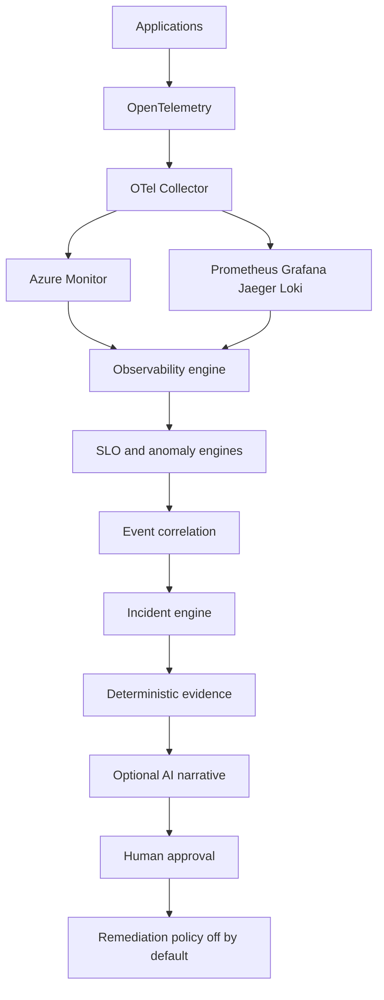

# Cloud Observability & AIOps Platform

A reusable cloud-native observability and AIOps platform for collecting telemetry, correlating incidents, detecting anomalies, performing evidence-based root-cause analysis, and assisting SRE teams with incident response.

The telemetry path is OpenTelemetry. Azure Monitor is one backend. Prometheus, Jaeger, Loki, and Grafana are the local backend. The incident, SLO, and correlation engines do not depend on either vendor, and they do not depend on a model.



## What this is for

Monitoring says something is wrong. This platform is built to answer the next questions: which service, which change, which dependency, which traces, and which evidence is still missing. A deployment that precedes an error spike is recorded as a **strong correlation**, not as a confirmed cause, unless a control-plane record actually confirms the change.

## For platform teams

- Onboard a service with `obsctl service onboard` and get a catalog entry, SLO file, runbook, and doc.
- Ship one collector config for local mode and one for Azure Monitor OTLP ingestion with managed identity.
- Reuse `service-ci.yml` from another repository.
- Keep vendor SDKs out of the domain model. `Incident`, `Deployment`, and `SLOResult` are cloud-neutral.

## For SRE teams

- SLI, error budget, and burn rate are calculated from request counts.
- Related alerts, anomalies, and dependency failures collapse into one incident.
- `obsctl incident analyze` refreshes the evidence pack and, if configured, asks a model to narrate it.
- If the model is down, incidents, metrics, logs, traces, SLOs, and the timeline still work.
- Restart, scale, and rollback exist and are **disabled until policy and a second person approve them**.

## Ten-minute local demo

```bash
make up
# Grafana http://localhost:3000  (anonymous viewer; admin / observability)
# Storefront http://localhost:8081
# Console http://localhost:8080/ui/
make demo
```

`make demo` enables `deployment-regression`, waits for one incident, runs analysis, disables the fault, and waits for SLO recovery. The narrative is in [docs/demo/complete-demo.md](docs/demo/complete-demo.md).

## Capabilities

| Area | What you get |
| --- | --- |
| Telemetry | OTLP traces, metrics, logs, runtime metrics, and optional Pyroscope profiles |
| Azure | Common alert schema, Resource Graph inventory, Log Analytics activity and health, and PromQL when `telemetry.backend=azure`. A subscription apply was not run |
| Kubernetes | Read-only adapter for warning events, pod symptoms, and rollout changes |
| SRE | SLOs, error budgets, multi-window burn rates, Alertmanager webhook |
| Detection | z-score, rolling window, threshold, rate-of-change, MAD, EWMA, and seasonal on error ratio, plus a p99 latency threshold |
| Incidents | Correlation, timeline, deployment lookback, postmortem from recorded facts |
| AIOps | Deterministic analysis always runs. OpenAI-compatible and Azure OpenAI are optional and schema-checked. They cannot upgrade a correlation to a cause |
| Change | Deployment records and demo faults are first-class evidence |
| Delivery | Terraform profiles, Helm, GitHub Actions, OIDC deploy workflow |
| Safety | Remediation off by default, approval required, audit log |

## Stack

Go platform and sample shop, PostgreSQL for platform state only, OpenTelemetry Collector, Prometheus, Grafana, Jaeger, Loki, Alertmanager, Terraform, Helm, GitHub Actions.

## Repository map

```text
cmd/                  platform, obsctl, demo services, traffic generator
internal/             SLO, anomaly, correlation, incidents, RCA, AI, API
config/               base config, environment overlays, service catalog, SLOs
collectors/           local and Azure collector configs
dashboards/grafana/   provisioned dashboards
demo/                 scenarios and expected results
docs/                 architecture, operations, security, ADRs
helm/platform/        Kubernetes chart
infra/terraform/      Azure profiles and modules
prompts/              versioned model instructions
runbooks/             machine-readable procedures
```

## Local commands

```bash
make up
make status
make logs
make demo
make fault-enable FAULT=payment-latency
make fault-disable FAULT=payment-latency
make down
make reset
```

No Azure account is required.

## Azure

```bash
make azure-plan PROFILE=azure-minimal
make azure-apply PROFILE=azure-minimal
make azure-destroy PROFILE=azure-minimal
```

`azure-minimal` creates the resource group, Log Analytics, Application Insights, an Azure Monitor workspace, a data collection endpoint, identity, ACR, Key Vault, and an action group. It does **not** create AKS or Azure Managed Grafana. `azure-production` adds the network, a one-node AKS cluster, and Managed Grafana. Costs and the OIDC setup are in [docs/deployment/azure.md](docs/deployment/azure.md) and [docs/cost.md](docs/cost.md).

This repository was not applied to a live subscription in the validation recorded in the changelog. `terraform validate` is the check that ran here.

## Example incident

A bad payment version is recorded at 10:31. The error rate moves at 10:34. The analysis says the symptom began about three minutes after `payment-service:v1.8.2`. That is a correlation. Rollback is a recommendation. It runs only after a different person approves it, and only if remediation is enabled.

## Security

See [SECURITY.md](SECURITY.md) and [docs/security/threat-model.md](docs/security/threat-model.md). Do not commit connection strings, API keys, or Terraform state.

## Testing

```bash
make lint
make test
```

The suite covers SLO math, burn rate, detectors, correlation, the incident state machine, redaction, RCA grades, AI merging, remediation approval, the HTTP API, and service onboarding.

## Contributing

[CONTRIBUTING.md](CONTRIBUTING.md). Architecture decisions are in [docs/adr](docs/adr/ADR-001-opentelemetry-first.md).

## Roadmap

[docs/roadmap.md](docs/roadmap.md). AWS and GCP adapters are boundaries, not implementations.

## License

Apache-2.0. See [LICENSE](LICENSE).
