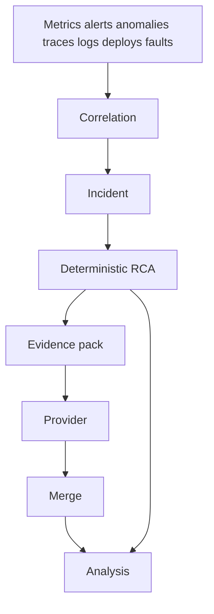

# AIOps path

The model is the last step.

`internal/ai.Merge` drops hypotheses that cite unknown evidence ids. It downgrades `confirmed` when the deterministic pack has no confirmed fact. It ignores impact statements that claim an entire region or all customers. Rollback recommended by the model is kept only when a strongly correlated deployment hypothesis already exists.

Providers:

| Name | Behavior |
| --- | --- |
| `mock` | Restates the deterministic summary. Default for local. |
| `openai-compatible` | `POST {base}/v1/chat/completions` |
| `local` | Same client, pointed at a local server |
| `azure-openai` | Deployment URL and `api-key` header |

Configuration is `ai` in the environment overlay, overridden by `AI_PROVIDER`, `AI_BASE_URL`, `AI_API_KEY`, `AI_MODEL`, and `AI_API_VERSION`. Prompts live in `prompts/`.
