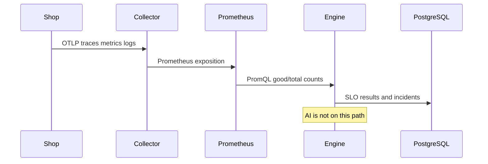

# Data flow



Resource attributes set on every shop process:

```text
service.name
service.version
deployment.environment
cloud.provider
cloud.region
team
owner
criticality
deployment.id
git.commit.sha
build.version
```

On Kubernetes, add `k8s.namespace.name`, `k8s.pod.name`, and `k8s.deployment.name` from the downward API. The Helm chart documents the identity annotation; the local compose file sets the non-Kubernetes attributes.

Logs emitted by the shop include `trace_id` and `span_id` from the active span. The collector redacts token-like attribute keys before export.

## Loss

| Dependency down | Effect |
| --- | --- |
| Collector | Apps keep serving. SDK exporters retry. A gap appears in the backends. |
| Prometheus | SLO tick degrades. Webhook alerts can still open incidents. |
| Jaeger or Loki | Evidence pack lists the gap. The incident is still created. |
| Model | `ai_status=degraded`. Deterministic analysis remains. |
| PostgreSQL | `/ready` fails. The shop does not depend on it except for fault polling, which keeps the last snapshot. |
| Grafana | Dashboards are unavailable. The API and UI are not. |
| Azure Monitor | Local exporters are independent. The Azure pipeline retries inside the collector. |
