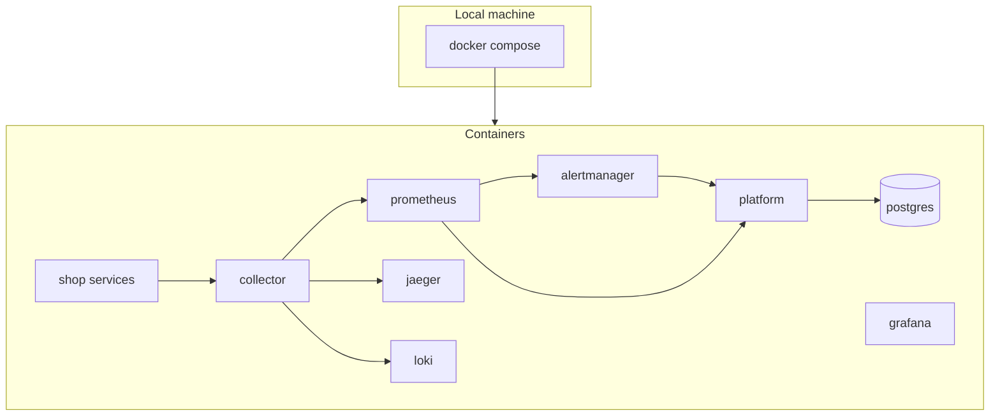
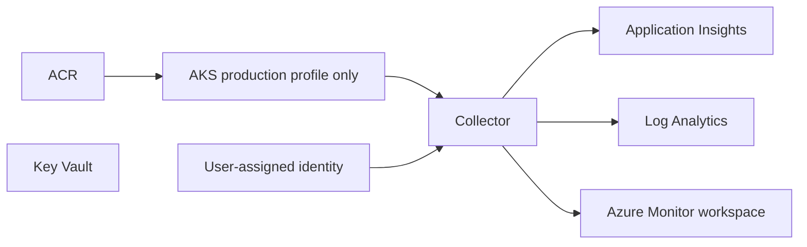
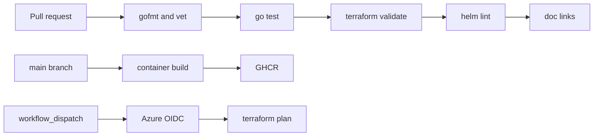
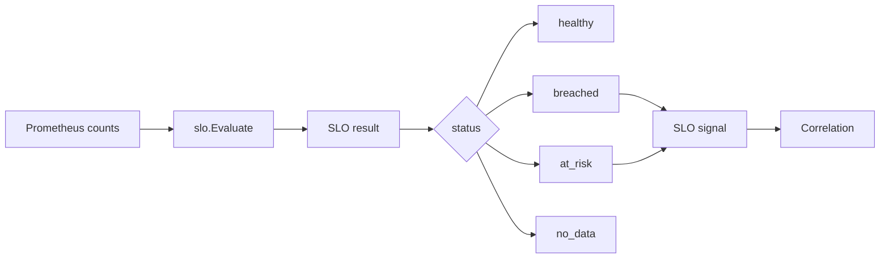
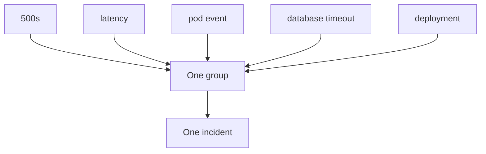

# Diagrams

These match the code and the compose file.

## Deployment

## Azure

`azure-minimal` stops before AKS. The collector still runs wherever you deploy it and uses the identity.

## Network

Local compose uses the default bridge network. Published ports are listed in [../deployment/local.md](../deployment/local.md).

The production profile creates `10.40.0.0/16` with an AKS subnet `10.40.1.0/24` and an NSG that denies inbound SSH and RDP from the internet. The Helm network policy allows ingress to the platform only on 8080.

## CI/CD

## SLO

## Incident correlation

## Security boundaries

See [../security/threat-model.md](../security/threat-model.md).
