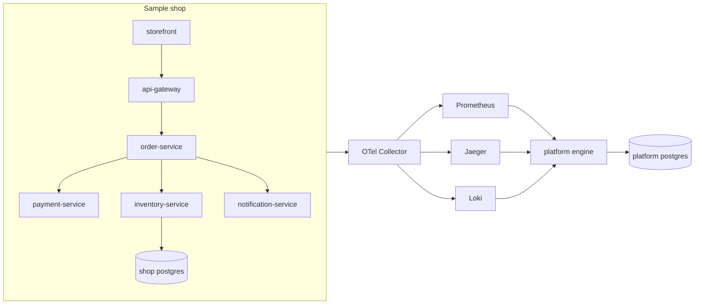

# Architecture

The platform is one Go process with explicit packages, plus a sample shop that only exists to emit telemetry.

Telemetry is not copied into PostgreSQL. PostgreSQL holds the catalog, SLO definitions and latest results, deployments, incidents, anomalies, faults, remediations, and the audit log.

The engine tick:

1. Query Prometheus for good and total requests per SLO window.
2. Run statistical detectors on the error-ratio series.
3. Read firing alerts and enabled faults.
4. Group symptoms that share a service, a dependency edge, or a trace id inside the correlation window.
5. Attach deployments from the lookback window as context, not as a separate incident.
6. Write a deterministic analysis.

`POST /api/v1/incidents/{id}/analyze` is the only path that calls the model.

## Packages

| Package | Responsibility |
| --- | --- |
| `internal/slo` | SLI, budget, burn rate |
| `internal/anomaly` | Detector interface and four statistical detectors |
| `internal/correlation` | Grouping |
| `internal/incident` | State machine |
| `internal/rca` | Evidence and hypotheses |
| `internal/ai` | Provider interface, chat completions, merge rules |
| `internal/remediation` | Policy, approval, demo executor, Kubernetes executor |
| `internal/redaction` | Headers, query parameters, JSON fields, bearer tokens |
| `internal/store` | Memory and PostgreSQL |
| `internal/engine` | The tick loop |
| `internal/api` | HTTP API and investigation UI |

Azure types do not appear in these packages. Collector YAML is the Azure adapter for telemetry export. Terraform is the Azure adapter for infrastructure.
