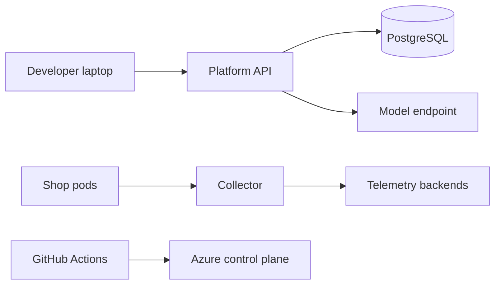

# Threat model

## Assets

- Telemetry that can contain tokens or customer identifiers if an application logs them
- Incident records and audit history
- Azure credentials and the Application Insights connection string
- The remediation role, which can delete pods and roll deployments
- The demo fault API, which can make the sample shop fail

## Trust boundaries

The shop does not trust the model. The model does not trust the shop's raw logs; it receives a redacted pack. The collector does not trust attribute values.

## Threats and mitigations

| Threat | Mitigation |
| --- | --- |
| Secrets in spans or logs | Collector redaction and platform redaction. Tests cover the common fields. |
| Stolen API token | Optional bearer token. Health endpoints stay open so probes work. |
| Remediation abuse | Disabled by default. Second-person approval. Allowlisted actions. DNS-label checks on Kubernetes names. Audit record. |
| Prompt injection in logs | The model only sees short excerpts, and merge drops hypotheses that cite ids the engine did not produce. |
| Supply chain | `go vet`, `govulncheck` in CI, non-root images, read-only root filesystem in Helm. |
| Over-broad cloud credentials | OIDC, no client secret in the workflow, role assignment scoped to the workspace and ACR. |
| Demo faults left on in production | `demo.enabled` is false in staging and production overlays. The route returns 404. |

## Residual risk

Redaction is pattern-based. A novel secret format can still pass. Sampling can hide the one trace that explains an incident. The Kubernetes executor is as powerful as its Role; do not bind that Role to a shared service account used by unrelated apps. Local Grafana anonymous access is a demo choice and must not be copied into a shared cluster.
